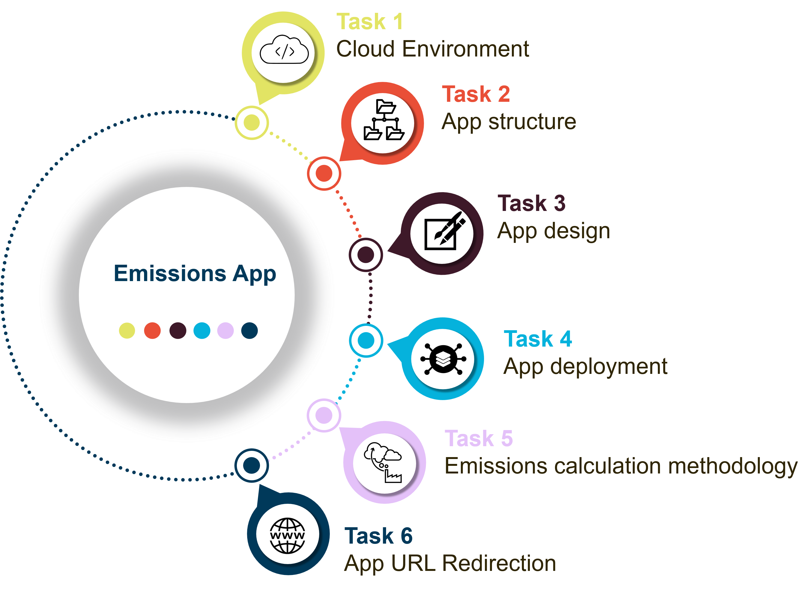

# ENE425 Emissions App
### This is an app created for the course ENE425 of the Norwegian School of Economics. 

Online App that stores, edit and remove records of emissions per individuals and between groups. 

The development was carried under Flask-Python, wtforms, sqlalchemy an deployed in Heroku. 

Records are dynamically updated in a Heroku PostgreSQL database.

Input

        User values through Graphical User Interface (GUI)
    
Output

        Dynamic App deployed in a Heroku server with emissions records per group and per group member
   
### Emissison's App tasks

    
